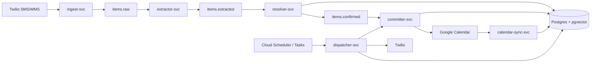

# bet

**A capacity-aware personal obligation engine that turns unstructured messages into durable, schedulable work while keeping LLMs behind deterministic system boundaries.**

BET is built around a simple rule: **models can interpret intent, but they should not control execution.**

## What it does

A user can send an obligation or idea through SMS/MMS. BET extracts structured intent, resolves missing information, checks for duplicates, persists the resulting state, and routes confirmed work into downstream actions such as calendar writes, reminders, and capacity-aware suggestions.

The system separates obligations from latent ideas, tracks their lifecycle explicitly, and can resurface deferred work when the user's schedule has room.

## Architecture



The core pipeline runs as independently deployable Python services on Cloud Run, connected through Pub/Sub. Cross-service handoffs are durable and replayable, with dead-letter handling around the asynchronous pipeline.

## Engineering decisions

### Deterministic control around LLM decisions

BET does not use a general-purpose orchestrator agent. The state machine decides what happens next; LLM-backed services make bounded decisions such as extracting fields, interpreting replies, or generating suggestion text.

That keeps control flow inspectable and prevents a model from deciding which privileged action to invoke next.

### Least-privilege service boundaries

External write access is isolated by service. Components that process raw user input do not hold Calendar write credentials. The committer is the privileged boundary for external writes.

This is enforced through service identities and IAM rather than relying only on prompts or conventions.

### Durable async execution

Pub/Sub sits between the main processing stages. Failed deliveries can move to dead-letter paths, where enough state is persisted to inspect and replay failures instead of depending on logs alone.

### Capacity-aware scheduling

The dispatcher computes available capacity from calendar state and persisted obligations, then decides when reminders or latent ideas should surface. Time-based work is scheduled through Cloud Scheduler and Cloud Tasks rather than in-process timers.

### Calendar reconciliation

A dedicated sync service reconciles external Calendar changes back into BET's state so moving or deleting an event outside the application does not leave the system inconsistent.

## Repository structure

```text
services/
  ingest-svc/          Twilio ingress and routing
  extractor-svc/       LLM-backed structured extraction
  resolver-svc/        clarification, dedupe, state resolution
  committer-svc/       privileged external writes and DLQ persistence
  dispatcher-svc/      reminders, capacity, suggestions, scheduled work
  calendar-sync-svc/   Calendar -> internal-state reconciliation
  registration-svc/   account registration
  dashboard-svc/       dashboard API
shared/                 shared schemas, DB and Pub/Sub utilities
infra/                  Terraform for GCP resources and IAM
migrations/             PostgreSQL migrations
docs/                   PRD, architecture docs, ADRs, test plan
web/                    Next.js dashboard and landing experience
```

## Reliability and testing

The repository includes unit and integration coverage across individual services and shared infrastructure. Tests cover webhook handling, extraction, Pub/Sub delivery, deduplication, resolver state transitions, calendar writes, capacity calculations, dispatcher behavior, registration, dashboard APIs, calendar synchronization, schema validation, and dead-letter handling.

The architecture also uses:

- explicit lifecycle states instead of hidden agent state
- replay-oriented service boundaries
- dead-letter handling for asynchronous failures
- structured correlation identifiers in logs
- PostgreSQL migrations for schema evolution
- typed shared message schemas

## Stack

**Backend:** Python 3.12, FastAPI, PostgreSQL, pgvector  
**AI:** Vertex AI / Gemini, embeddings  
**Cloud:** Google Cloud Run, Pub/Sub, Cloud Tasks, Cloud Scheduler, Cloud SQL, GCS, Secret Manager  
**Infrastructure:** Terraform, Docker  
**Integrations:** Twilio, Google Calendar  
**Web:** Next.js, TypeScript, React  
**Tooling:** uv, pytest, Ruff

## Documentation

The repository includes implementation-grade design documentation rather than keeping architecture decisions implicit in the codebase.

- [`docs/product/prd.md`](docs/product/prd.md) - product requirements and system intent
- [`docs/architecture/overview.md`](docs/architecture/overview.md) - service topology and write boundaries
- [`docs/architecture/state-machine.md`](docs/architecture/state-machine.md) - lifecycle and transition rules
- [`docs/architecture/data-model.md`](docs/architecture/data-model.md) - schema and persistence model
- [`docs/architecture/capacity-engine.md`](docs/architecture/capacity-engine.md) - capacity computation and scheduling logic
- [`docs/architecture/agent-contracts.md`](docs/architecture/agent-contracts.md) - model I/O contracts
- [`docs/architecture/infrastructure.md`](docs/architecture/infrastructure.md) - GCP resources, IAM, and deployment design
- [`docs/decisions/`](docs/decisions/) - architecture decision records
- [`docs/engineering/test-plan.md`](docs/engineering/test-plan.md) - test strategy

## Local development

BET is a `uv` workspace with independently packaged services.

```bash
git clone https://github.com/IzaanQaiser/bet.git
cd bet
uv sync
uv run pytest services/ shared/
```

Individual services have their own `pyproject.toml` files and can be run independently during development. Cloud-backed integration paths require the corresponding local credentials and emulator/proxy setup documented under [`docs/architecture/infrastructure.md`](docs/architecture/infrastructure.md).

## Why I built it

Most assistants are good at responding immediately but weak at long-running responsibility. BET explores a different model: capture something once, preserve its state, decide when action is appropriate, and make execution recoverable when external systems fail.

The project became an exercise in building agentic software as a distributed system rather than as a single prompt loop: explicit state, bounded model authority, durable queues, replay, observability, and infrastructure-level permission boundaries.
