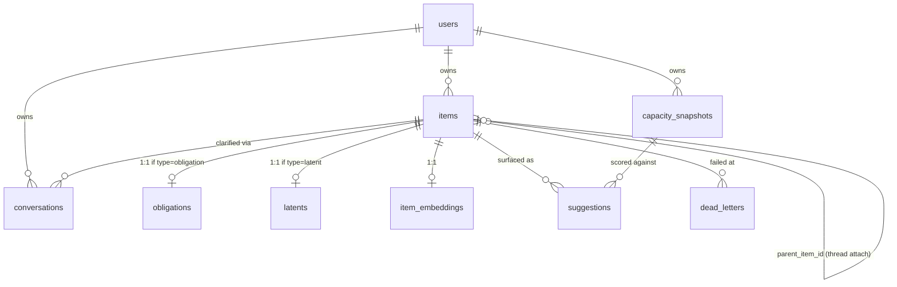

# Data Model

Third doc in the architecture set — see `overview.md` §0. Canonical schema: where the PRD's §8 sketch and this doc disagree, this doc wins — the PRD is a first pass, this is what actually gets migrated. Deviations are called out explicitly in §3.

Single Cloud SQL for PostgreSQL instance, `pgvector` extension enabled (ADR [0004](../decisions/0004-single-postgres-instance.md)). No ORM — this DDL is what `migrations/0001_init.sql` will contain when service code-writing starts (`docs/engineering/conventions.md`).

---

## 1. Entity relationship diagram



---

## 2. DDL

```sql
CREATE EXTENSION IF NOT EXISTS vector;

CREATE TABLE users (
    id                    uuid PRIMARY KEY DEFAULT gen_random_uuid(),
    phone_e164            text NOT NULL UNIQUE,
    google_refresh_token_ref text,          -- reference into Secret Manager, not the token itself
    timezone              text NOT NULL,     -- IANA tz name, e.g. 'America/Los_Angeles'
    working_hours_start   time NOT NULL DEFAULT '09:00',
    working_hours_end     time NOT NULL DEFAULT '18:00',
    created_at            timestamptz NOT NULL DEFAULT now()
);

CREATE TABLE items (
    id             uuid PRIMARY KEY DEFAULT gen_random_uuid(),
    user_id        uuid NOT NULL REFERENCES users(id),
    raw_channel    text NOT NULL DEFAULT 'sms' CHECK (raw_channel IN ('sms')),
    raw_media_uri  text,                     -- GCS URI, null for text-only
    ingested_at    timestamptz NOT NULL DEFAULT now(),

    type           text CHECK (type IN ('obligation', 'latent')),   -- nullable: unknown until EXTRACTED (see §2.6)
    state          text NOT NULL CHECK (state IN (
                       'RECEIVED', 'EXTRACTED', 'DUPLICATE_SUSPECTED',
                       'CLARIFYING', 'NEEDS_REVIEW', 'AWAITING_CONFIRMATION',
                       'CANCELLED', 'CONFIRMED', 'COMMITTED', 'MERGED', 'FAILED'
                   )),

    title          text,
    summary        text,
    effort_minutes int CHECK (effort_minutes IN (15, 30, 60, 120, 240)),
    focus_depth    text CHECK (focus_depth IN ('shallow', 'deep')),
    confidence     numeric(3,2) CHECK (confidence BETWEEN 0 AND 1),

    dedupe_hash    text,                     -- sha256(lower(trim(title)) || '|' || lower(trim(summary))); see §2.1
    parent_item_id uuid REFERENCES items(id),

    created_at     timestamptz NOT NULL DEFAULT now(),
    updated_at     timestamptz NOT NULL DEFAULT now()
);
CREATE INDEX idx_items_user_state ON items(user_id, state);
CREATE INDEX idx_items_dedupe_hash ON items(dedupe_hash) WHERE dedupe_hash IS NOT NULL;

CREATE TABLE obligations (
    item_id            uuid PRIMARY KEY REFERENCES items(id),
    due_at             timestamptz,
    calendar_event_id  text,
    reminder_sent_at   timestamptz,
    reminder_window_hours int NOT NULL DEFAULT 24,
    action_type        text NOT NULL DEFAULT 'calendar' CHECK (action_type IN ('calendar', 'email')),
    email_draft        text,
    email_sent_at      timestamptz
);

CREATE TABLE latents (
    item_id           uuid PRIMARY KEY REFERENCES items(id),
    last_surfaced_at  timestamptz,
    surface_count     int NOT NULL DEFAULT 0,
    dismissal_count   int NOT NULL DEFAULT 0,
    dormant_until     timestamptz          -- reused for both dismissal-dormancy (30d) and snooze (7d); see state-machine.md §2.2
);
CREATE INDEX idx_latents_dormant_until ON latents(dormant_until) WHERE dormant_until IS NOT NULL;

CREATE TABLE item_embeddings (
    item_id    uuid PRIMARY KEY REFERENCES items(id),
    embedding  vector(768) NOT NULL          -- text-embedding-004
);
CREATE INDEX idx_item_embeddings_hnsw ON item_embeddings
    USING hnsw (embedding vector_cosine_ops);

CREATE TABLE capacity_snapshots (
    id                       uuid PRIMARY KEY DEFAULT gen_random_uuid(),
    user_id                  uuid NOT NULL REFERENCES users(id),
    date                     date NOT NULL,
    free_minutes             int NOT NULL,
    largest_contiguous_block int NOT NULL,
    fragmentation_index      numeric(4,3) NOT NULL,
    load_delta               numeric(5,3) NOT NULL,
    computed_at              timestamptz NOT NULL DEFAULT now(),
    UNIQUE (user_id, date)
);

CREATE TABLE suggestions (
    id           uuid PRIMARY KEY DEFAULT gen_random_uuid(),
    item_id      uuid NOT NULL REFERENCES items(id),
    user_id      uuid NOT NULL REFERENCES users(id),   -- denormalized; see §2.2
    snapshot_id  uuid NOT NULL REFERENCES capacity_snapshots(id),
    sent_at      timestamptz NOT NULL DEFAULT now(),
    outcome      text CHECK (outcome IN ('accepted', 'dismissed', 'snoozed', 'no_response')),
    responded_at timestamptz
);
CREATE INDEX idx_suggestions_user_open ON suggestions(user_id) WHERE outcome IS NULL;
CREATE INDEX idx_suggestions_item ON suggestions(item_id);

CREATE TABLE conversations (
    id             uuid PRIMARY KEY DEFAULT gen_random_uuid(),
    user_id        uuid NOT NULL REFERENCES users(id),
    item_id        uuid NOT NULL REFERENCES items(id),
    exchange_count int NOT NULL DEFAULT 0,
    last_message_at timestamptz NOT NULL DEFAULT now(),
    pending_fields text[],                   -- e.g. {'due_at'}; rendering detail in agent-contracts.md
    resolved_fields jsonb NOT NULL DEFAULT '{}'::jsonb  -- obligation-specific values with no items/obligations column to live in pre-commit; see §2.4
);
CREATE INDEX idx_conversations_user ON conversations(user_id);

CREATE TABLE dead_letters (
    id          uuid PRIMARY KEY DEFAULT gen_random_uuid(),
    item_id     uuid NOT NULL REFERENCES items(id),
    stage       text NOT NULL,               -- topic name the message failed on, e.g. 'items-extracted'
    payload     jsonb NOT NULL,               -- the message body itself, inline; see §2.3
    error       text NOT NULL,
    retry_count int NOT NULL,
    created_at  timestamptz NOT NULL DEFAULT now()
);
CREATE INDEX idx_dead_letters_item ON dead_letters(item_id);
```

### 2.1 `dedupe_hash` — cheap prefilter before the embedding call

Not described in the PRD's resolver algorithm (§5.2), only listed in the schema sketch. Clarified here: on entering `EXTRACTED`, `resolver-svc` computes `dedupe_hash` and checks for an exact match *before* running the embedding search. An exact hash match is treated identically to a `similarity ≥ 0.92` embedding match — routed to `DUPLICATE_SUSPECTED`, same "is this the same as X?" flow, never silently merged (ADR 0003's "never merge silently" applies regardless of which check found the match). The only thing the hash prefilter buys is skipping a Vertex AI embedding call in the common case of an exact or near-exact resend — it does not change the dedupe UX.

### 2.2 `suggestions.user_id` — denormalized, not in the PRD sketch

Added here. The inbound-SMS routing check in `state-machine.md` §4 ("a `suggestions` row for this user with `outcome IS NULL`") runs on **every inbound SMS**, synchronously, before the message can be handled. Without `user_id` on `suggestions`, that query needs a join through `items`; with it, it's `idx_suggestions_user_open`, a partial index scan on `user_id` alone. Worth the denormalization for a query on the hot path; `item_id` is kept too since most other queries (recording an outcome, joining to `capacity_snapshots`) key off it naturally.

### 2.3 `dead_letters.payload` — inline, not a reference

The PRD sketch names this column `payload_ref`, implying a pointer (e.g. to GCS). Resolved here as inline `jsonb`, renamed to `payload`: every message on `items.raw` / `items.extracted` / `items.confirmed` is a small structured JSON envelope (ids, refs, extracted fields — never raw media bytes, which live in GCS and are referenced by URI within the payload itself). There's nothing large enough here to justify a second storage hop; inlining keeps a failed message replayable with one row read instead of a row read plus a GCS fetch.

### 2.4 `conversations.resolved_fields` — where `due_at` lives before commit

**Resolved bug, not in the PRD sketch at all.** `due_at` has no column on `items` — it lives only on `obligations` (§2, above) — and `resolver-svc` has no Postgres grant on `obligations` (`infrastructure.md` §2.2; only `committer-svc` writes it, at commit time). So as originally written, once the clarification call (`agent-contracts.md` §3.2) resolved a `due_at` from a reply, there was nowhere for `resolver-svc` to durably persist it before the user confirms — Cloud Run instances are stateless between invocations, so it can't just be held in memory across turns either.

Fixed here: `resolved_fields` holds obligation-specific values resolved during the pipeline but not yet committed — `due_at`, and as of step 15, `action_type`/`email_draft` too (`agent-contracts.md` §2.1/§3.2 — the email-action stretch's drafting mechanism, resolved rather than left open). **`resolver-svc` creates the `conversations` row unconditionally the moment it consumes an `items.extracted` message** — not only when clarification is actually needed — and immediately stages any `due_at` the extractor already produced into `resolved_fields`. This means the zero-clarification-needed path (straight to `AWAITING_CONFIRMATION`) still has somewhere for `due_at` to live, not just the multi-exchange path. One `conversations` row per item, used as `resolver-svc`'s scratchpad from `EXTRACTED` through to `CONFIRMED`/`CANCELLED`/`NEEDS_REVIEW`/`MERGED`.

`title`/`summary`/`effort_minutes`/`focus_depth`/`confidence` don't have this problem — they're already columns on `items`, and `resolver-svc` has `UPDATE` on `items` (`infrastructure.md` §2.2), so those get written straight there as they're resolved.

### 2.6 `items.type` — made nullable (migration 0002)

**Resolved bug, found while implementing `ingest-svc` (build step 3).** `type` was originally `NOT NULL` — wrong: `ingest-svc` writes the `RECEIVED` row before any extraction has happened, and whether an item is an `obligation` or a `latent` is exactly what `extractor-svc` determines (`state-machine.md` §1, `RECEIVED → EXTRACTED`). There is no legitimate value `ingest-svc` could put there. `migrations/0001_init.sql` is left as applied (forward-only, `docs/engineering/conventions.md`); `migrations/0002_items_type_nullable.sql` drops the `NOT NULL`. The `CHECK (type IN (...))` constraint is untouched and still correct — Postgres treats a `NULL` as satisfying a `CHECK`, so this required no other change.

### 2.7 `item_embeddings` write timing and dedupe scratchpad keys — resolved gaps from step 12

Neither this doc nor `state-machine.md` §1.1 specified *when* an item's own embedding gets written to `item_embeddings` — only that a cosine search reads from it. Decided here: `resolver-svc` embeds and stores an item's own `title + summary` at the same point it runs the dedupe check itself (immediately on entering `EXTRACTED`, right after the `dedupe_hash` prefilter misses), mirroring `dedupe_hash`'s own "always computed on entry, regardless of eventual outcome" behavior exactly — not deferred to `CONFIRMED`/`COMMITTED`. Consequence, accepted rather than engineered around: an item that later ends up `CANCELLED` or `MERGED` still has a permanent `item_embeddings` row and can still surface as a future dedupe match (its title/summary content is still real content, even if its own pipeline outcome wasn't). An exact-hash match skips this entirely — no embedding is computed or stored on that path, matching the acceptance criterion that a hash-caught resend costs no embedding API call.

Also not specified anywhere: where a *pending* dedupe match (awaiting the user's Y/N to "is this the same as X?") or a decided-but-not-yet-rendered thread-attach candidate lives between the moment it's found and the moment it's needed again — possibly several messages later, after a full clarification exchange. `items.parent_item_id` is reserved for the *confirmed* thread-attach relationship only (§1.1 point 3's "set only if the user opts in"); reusing it for a still-pending candidate would conflate two different meanings on one column. Both instead ride in `conversations.resolved_fields` (§2.4's scratchpad) under `_dedupe_match_item_id`/`_dedupe_match_title` and `_thread_attach_item_id`/`_thread_attach_title` — private keys by convention (leading underscore), not part of the `resolved_fields` "obligation-specific values" contract §2.4 originally described, but the same jsonb column already exists for exactly this kind of pipeline-scratchpad need and a second column for two more foreign keys would need the same "which service can even write here" reasoning §2.4 already went through once.

### 2.5 `conversations.state` — removed from the PRD sketch

The PRD sketch lists a `state` column on `conversations`. Dropped here: it would duplicate `items.state`, which already distinguishes `CLARIFYING` from `AWAITING_CONFIRMATION` for the same item, and two columns tracking the same fact is a drift risk (which one does `resolver-svc` trust if they ever disagree?). "Is this conversation open" is answered by joining to `items.state IN ('DUPLICATE_SUSPECTED', 'CLARIFYING', 'AWAITING_CONFIRMATION')` — a two-table join on indexed columns (`conversations.user_id`, `items` primary key), cheap enough at this scale. `items.state` remains the single source of truth for pipeline position, full stop. (`DUPLICATE_SUSPECTED` added to this set in step 12 — see §2.7; the query above was originally the two step-9/10 states only.)

---

## 3. Summary of deviations from the PRD §8 sketch

The PRD is intentionally a first-pass sketch, not the canonical schema — this section exists so the gap is visible rather than silent:

| PRD sketch | This doc | Why |
|---|---|---|
| `dead_letters.payload_ref` | `dead_letters.payload jsonb`, inline | §2.3 — nothing here is large enough to warrant a reference |
| `conversations.state` present | Removed | §2.5 — redundant with `items.state`, drift risk |
| `conversations` has no field for resolved-but-uncommitted obligation data (`due_at` etc.) | Added `resolved_fields jsonb` | §2.4 — nowhere else to stage it before commit |
| `suggestions` has no `user_id` | Added, denormalized | §2.2 — hot-path routing query needs it join-free |
| `latents` has no explicit snooze column | `dormant_until` reused for snooze, not a new column | `state-machine.md` §2.2 — one column, two callers, documented here per that doc's own note |
| `items.type` was `NOT NULL` | Made nullable (migration 0002) | §2.6 — unknown until `EXTRACTED`, `ingest-svc` has no legitimate value to write |
| No service had `SELECT` on `users` | Granted to all four service roles (migration 0003) | `infrastructure.md` §2.2 — found when `ingest-svc`'s phone lookup failed live; every service needs this eventually |

---

## 4. Migration strategy

Per `docs/engineering/conventions.md`: this DDL becomes `migrations/0001_init.sql` verbatim when service code-writing starts, applied via `scripts/migrate.sh`. Forward-only — no down-migrations are written; a mistake becomes a new numbered migration, not a rollback script.

---

## 5. Open items for sibling docs

- ~~Exact rendering of `conversations.pending_fields` into a batched SMS question, and the literal Pub/Sub message shapes that reference these rows~~ → done, see `agent-contracts.md` §1, §3.2.
- `capacity_snapshots` is written by `dispatcher-svc` once per user per day (`UNIQUE (user_id, date)` enforces one row) — the exact computation producing `free_minutes` / `largest_contiguous_block` / `fragmentation_index` / `load_delta` is `capacity-engine.md`'s job, not this doc's.
- ~~Service account roles that map to the write-access matrix in `overview.md` §3 (who gets `INSERT`/`UPDATE` on which table, concretely)~~ → done, see `infrastructure.md` §2.2.
