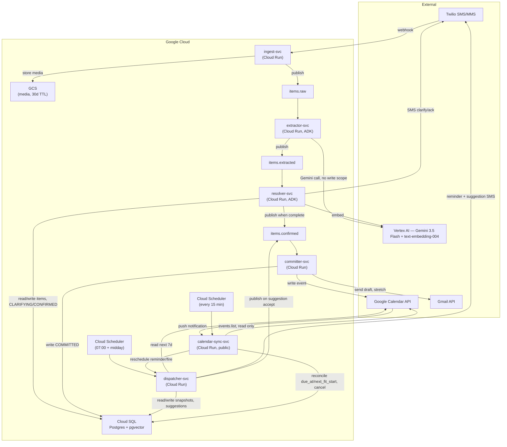
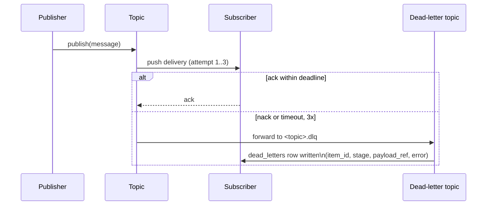

# Architecture Overview

Canonical, implementation-grade architecture for the Capacity-Aware Obligation Engine. Product intent lives in [`docs/product/prd.md`](../product/prd.md) — read that first for *why*. This doc and its siblings in `docs/architecture/` are the *how*, at the level of detail an implementer should not have to guess past.

Sibling docs (written one at a time, in this order):
1. **`overview.md`** (this doc) — service topology, write-access boundaries, data flow
2. `state-machine.md` — item and latent lifecycle, transition rules, failure handling (done)
3. `data-model.md` — schema, indexes, migration strategy (done)
4. `capacity-engine.md` — snapshot computation and scoring, worked examples (done)
5. `agent-contracts.md` — exact I/O schemas and prompts for Extractor, Resolver, Dispatcher (done)
6. `infrastructure.md` — GCP resource inventory, IAM bindings, IaC structure (done)

Until a sibling doc exists, do not invent its content to unblock implementation — flag the gap instead (per `AGENTS.md`).

---

## 1. Design principles this architecture enforces

These are inherited from the PRD's non-negotiables (§15) and translated into structural constraints, not conventions:

- **No orchestrator agent.** Control flow is an explicit state machine (`state-machine.md`). LLM agents decide *content* (what to extract, what to ask, what to suggest); they never decide *what happens next in the pipeline*. This is enforced by construction — agents are invoked by pipeline code with a fixed next-step, not given tools to call the next stage themselves.
- **Write access is scoped per service, enforced by IAM.** Not "the extractor shouldn't write to the calendar" as a convention the code happens to follow — the extractor's service account has no Calendar or Gmail scope and no DB write role. A prompt injection in a photographed note cannot escalate past what the service account can physically do.
- **External writes are structurally isolated, not prompt-instructed.** Only `committer-svc` holds Calendar/Gmail write credentials, and it only ever consumes typed commit messages from `items.confirmed` or explicit placeholder requests from `dispatcher-svc`. The LLM call sites never receive write tools or write credentials, and the services that touch raw Twilio/media input cannot call Calendar or Gmail.
- **Every cross-service handoff is durable and replayable.** Pub/Sub between every stage, not direct service-to-service calls. A crashed service doesn't lose the item — it redelivers. This is also what makes the dead-letter queue possible at every stage uniformly.

---

## 2. Service topology

Five Cloud Run services in the core pipeline (plus `dashboard-svc` and `calendar-sync-svc`, added after this diagram was first drawn — see the open item at the bottom of this doc), two Cloud Scheduler jobs, five Pub/Sub topics (four pipeline + one fan-out for dead-letters per topic in practice, detailed in §4).

### Service responsibilities

| Service | Responsibility | Invoked by |
|---|---|---|
| `ingest-svc` | Validate Twilio webhook signature, persist media to GCS, publish raw item to `items.raw`. No LLM calls. | Twilio webhook (sync HTTP) |
| `extractor-svc` | Consume `items.raw`, call Gemini 3.5 Flash with strict schema, publish to `items.extracted`. | Pub/Sub push |
| `resolver-svc` | Consume `items.extracted`, run dedupe + clarification over SMS, hold `conversations` state, publish to `items.confirmed` once required fields are complete. | Pub/Sub push + Twilio inbound SMS webhook (a conversation spans multiple inbound messages) |
| `committer-svc` | Consume `items.confirmed`, write to Calendar (and Gmail, stretch), mark item `COMMITTED`. Also the dead-letter writer: subscribes to all three `.dlq` topics and persists `dead_letters` rows (decision made in `infrastructure.md` §2.1 — reuses this service rather than standing up a sixth one). | Pub/Sub push |
| `dispatcher-svc` | Compute capacity snapshots, fire deadline reminders, schedule latent placeholders, fire suggestions at their next-fit slots, and classify suggestion replies. | Cloud Scheduler (cron), Cloud Tasks, and manual trigger endpoint for demo/judging |
| `calendar-sync-svc` | Reconcile changes made directly on Google Calendar (deletions, time moves) back into `items`/`obligations`/`latents` — the reverse of the direction every other service already writes. Registers a Calendar `events.watch` push channel per linked user and runs `events.list` incremental sync (`syncToken`) on every push; a 15-minute Cloud Scheduler run is the fallback poll and channel-renewal check, same precise-push + infrequent-poll shape as reminders. Only ever reads Calendar and writes Postgres — never calls the Calendar write API, so it doesn't touch the single-writer boundary below. | Google Calendar push notification (public webhook) + Cloud Scheduler (cron) |

`ingest-svc` is the single Twilio-facing webhook — Twilio supports one messaging webhook per number, so every inbound SMS, whether a brand-new item or a reply mid-conversation, lands there first. `ingest-svc` does a cheap routing check (open `conversations` row for this user → forward to `resolver-svc`; else a pending, unanswered `suggestions` row → forward to `dispatcher-svc`; else treat as a new item and publish to `items.raw`) via a synchronous internal call authenticated by Cloud Run service-to-service IAM, not a public route. Full routing precedence and reply semantics are in `docs/architecture/state-machine.md`.

**Three asymmetries** in an otherwise uniform "topic in, topic out" topology (was one, before ADR [0009](../decisions/0009-tentative-placeholder-write-before-confirm.md)):
1. `ingest-svc` sometimes calls `resolver-svc`/`dispatcher-svc` directly instead of only publishing (above).
2. `dispatcher-svc` calls `committer-svc` directly (`PUT`/`DELETE /latents/{item_id}/placeholder`) to request a tentative idea-placeholder write — synchronous because it needs the real Calendar event id back immediately, to persist into `latents.placeholder_event_id` (capacity-engine.md §5.2, ADR 0009). `committer-svc` remains the only service that ever calls the Calendar write API in either case.
3. `calendar-sync-svc` is the only public (`--allow-unauthenticated`) service in the system — required because Google's push notifications carry no Cloud Run IAM token, and that toggle is service-wide rather than per-route. It is scoped to exactly one webhook route plus one Scheduler-triggered route, both independently verified in application code (channel-token check on the webhook; Google-signed OIDC identity check on the Scheduler route) rather than relying on platform IAM. It calls `dispatcher-svc`'s existing `/dispatch/reminders/fire` and `/latents/{item_id}/fire` endpoints to re-schedule Cloud Tasks after a reconciled time change, the same way `committer-svc` already does.

---

## 3. Write-access matrix

This table is the security story. Enforced via per-service service accounts and IAM roles — not application-level checks.

| Service | Reads | Writes | Vertex AI access | Google OAuth scopes |
|---|---|---|---|---|
| `ingest-svc` | Twilio payload | GCS (media), `items.raw` topic | none | none |
| `extractor-svc` | `items.raw` | `items.extracted` topic | Gemini (generate) | **none** |
| `resolver-svc` | `items.extracted`, `items` (own conversation), `item_embeddings` | `items` (state `CLARIFYING`/`CONFIRMED`), `conversations`, `item_embeddings`, `items.confirmed` topic, Twilio (outbound SMS) | Gemini (generate), embeddings | **none** |
| `committer-svc` | `items.confirmed`, `items.raw.dlq`, `items.extracted.dlq`, `items.confirmed.dlq` | `items` (state `COMMITTED`), `obligations`, `latents`, `dead_letters` | none | Calendar (write), Gmail (send, stretch only) |
| `dispatcher-svc` | `items`, `latents`, `capacity_snapshots`, `suggestions` | `capacity_snapshots`, `suggestions`, `latents` (surface metadata, `next_fit_start`/`placeholder_event_id`), Twilio (outbound SMS), `items.confirmed` topic (publish only after classifying a suggestion reply as accept), `committer-svc` (`run.invoker`, for the placeholder call above), Cloud Tasks `reminders` queue (`cloudtasks.enqueuer`, new — previously only ever a Cloud Tasks target) | Gemini (generate, suggestion text/reply intent), no tools | Calendar (read only) — never gains write scope; a Calendar write it causes goes through `committer-svc`, see ADR 0009 |
| `calendar-sync-svc` | Google Calendar push notifications + `events.list` deltas, `calendar_sync_channels`, `items`/`obligations`/`latents`/`users` (read, to match incoming events and read refresh tokens) | `calendar_sync_channels` (channel/sync token bookkeeping), `items` (state `CANCELLED` only), `obligations` (`due_at`, `reminder_*_at`), `latents` (`next_fit_start`, `placeholder_event_id`), Cloud Tasks `reminders` queue (`cloudtasks.enqueuer`), `dispatcher-svc` (`run.invoker`, to re-fire reminder/placeholder tasks after a reconciled time change) | none | Calendar (read only) — same `calendar.events` scope already granted, no new consent; never calls the Calendar write API |

Read this table top to bottom and confirm: **no service that touches untrusted user input (`ingest-svc`, `extractor-svc`) holds any external write credential.** The only services with Calendar/Gmail write scope (`committer-svc`) or Calendar read scope (`dispatcher-svc`, `calendar-sync-svc`) never see raw user input directly — they only consume typed, structured pipeline state, or in `calendar-sync-svc`'s case, Calendar state that only ever originated from this system's own prior writes (any event with no match in `obligations`/`latents` is skipped, never touched).

---

## 4. Data flow: durability and failure handling

Every arrow in §2 that crosses a service boundary via Pub/Sub follows the same pattern:

Concretely: `items.raw`, `items.extracted`, `items.confirmed` each have a paired `.dlq` topic. A subscriber that fails 3 delivery attempts (application error, not a 4xx from bad input — those nack immediately with a reason logged) lands the message in the DLQ, and a row is written to `dead_letters` with enough context (`item_id`, `stage`, `payload_ref`, `error`) to replay manually. This is what "queryable state" in the PRD's state machine section actually rests on — every item's current state and failure history is reconstructable from `items` + `dead_letters` alone, no log spelunking required.

`dispatcher-svc` has no upstream topic (it's cron-triggered) so it has no DLQ in this sense; its failure mode is "the run didn't happen" and is handled by Cloud Scheduler retry + alerting, not a dead-letter row.

---

## 5. Correlation and observability

Every service logs structured JSON with `item_id` (or, for dispatcher runs with no single item, `dispatch_run_id`) as a correlation field. This is what lets a judge — or you, on camera — follow one screenshot from Twilio webhook through extraction, clarification/auto-commit, and calendar write in Cloud Logging, filtered on a single ID. No distributed tracing system is being introduced for a 9-day build; structured logs with a consistent correlation key is the entire observability strategy, and it's sufficient for this scale.

---

## 6. Open items for sibling docs

Flagging rather than deciding here, per `AGENTS.md`:

- ~~Exact Pub/Sub message schemas per topic~~ → done, see `agent-contracts.md` §1
- ~~`conversations` state machine detail (how clarification exchanges are counted, batched, and exhausted)~~ → done, see `state-machine.md`
- ~~Capacity snapshot computation detail and worked numeric examples~~ → done, see `capacity-engine.md`
- ~~Terraform/gcloud resource list, service account names, exact IAM role bindings~~ → done, see `infrastructure.md` §1–§2, §6.
- ~~Local dev story (Pub/Sub emulator, Cloud SQL proxy)~~ → done, see `infrastructure.md` §7.
- **Gap, flagged not filled:** `dashboard-svc` (the web read/write surface for the account, `PATCH /me/profile`, `DELETE /me/items/{id}`, per `status.md`) predates `calendar-sync-svc` but was never added to this doc's diagram, service table, or write-access matrix. Not filled in here since its exact scope wasn't re-derived as part of this change — needs its own pass.
