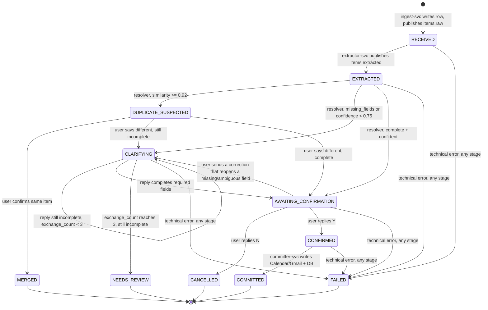
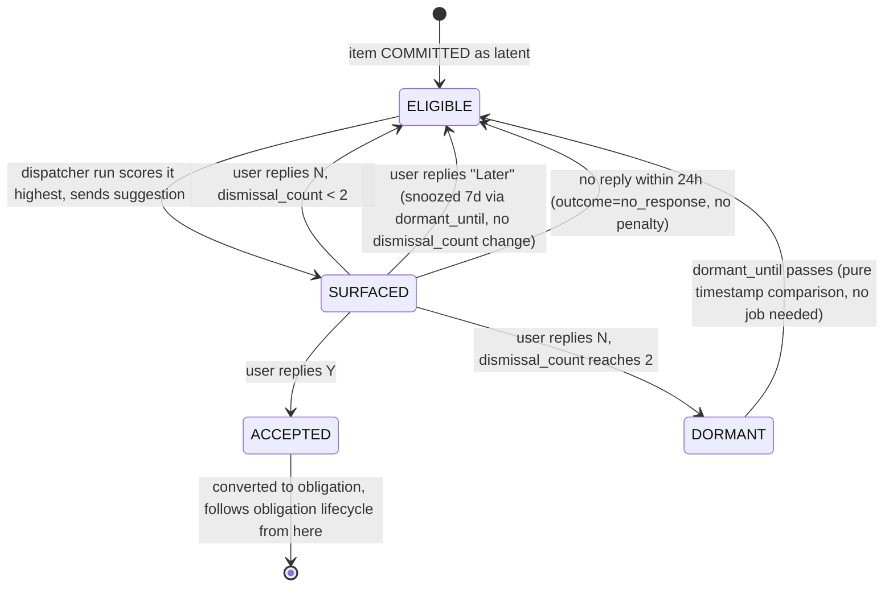

# State Machine

Second doc in the architecture set — see `overview.md` §0 for the full list. This doc owns everything `overview.md` deferred under "conversations state machine detail" and "how clarification exchanges are counted, batched, and exhausted."

Two lifecycles, deliberately kept separate:
1. **Pipeline lifecycle** — every item goes through this once, linearly, from `RECEIVED` to a terminal state.
2. **Latent lifecycle** — only applies after a latent item reaches `COMMITTED`; cyclical, can run for weeks.

Per ADR [0001](../decisions/0001-no-orchestrator-agent.md): every transition below is triggered by pipeline code reacting to an event (a Pub/Sub message consumed, a user reply parsed, a dispatcher run completing) — never by an agent deciding to move the item forward.

---

## 1. Pipeline lifecycle



### State reference

| State | Meaning | Who acts here | Persisted? |
|---|---|---|---|
| `RECEIVED` | Raw item stored, awaiting extraction | `extractor-svc` consumes | Yes |
| `EXTRACTED` | Structured fields present, not yet checked | `resolver-svc` consumes | Yes |
| `DUPLICATE_SUSPECTED` | High-similarity match found, awaiting user disambiguation | `resolver-svc`, waits on SMS reply | Yes |
| `CLARIFYING` | Missing/low-confidence fields, question sent | `resolver-svc`, waits on SMS reply | Yes |
| `NEEDS_REVIEW` | Clarification budget exhausted, still incomplete | Terminal for MVP — see §1.3 | Yes |
| `AWAITING_CONFIRMATION` | Complete record shown to user, awaiting Y/N/correction | `resolver-svc`, waits on SMS reply | Yes |
| `CANCELLED` | User declined | Terminal | Yes |
| `CONFIRMED` | User affirmed, about to commit | `committer-svc` consumes from `items.confirmed` | Yes (brief) |
| `COMMITTED` | Written to Calendar/Gmail + DB | Terminal for obligations; start of latent lifecycle (§2) for latents | Yes |
| `MERGED` | Confirmed duplicate of an existing item | Terminal | Yes |
| `FAILED` | Technical failure at any stage | Dead-letter, see §3 | Yes |

### 1.1 Dedupe check (on entering `EXTRACTED`)

Runs once, immediately, before the completeness check — per PRD §5.2 ordering.

1. Embed `title + summary` (`text-embedding-004`), cosine search `item_embeddings` for this user.
2. `similarity ≥ 0.92` → `DUPLICATE_SUSPECTED`. Send: *"Is this the same as [existing title]?"* Reply `Y` → `MERGED` (no new `obligations`/`latents` row is created; the existing item's record is left untouched — a duplicate confirms nothing new, it discards the incoming one). Reply `N` → proceed to the completeness check as if no match existed.
3. `0.82 ≤ similarity < 0.92` **and** the existing match is a latent → not a blocking state. This is folded into the eventual confirmation message as an optional suffix (§1.2) rather than its own stage, since PRD §5.2 calls it an "offer," not a requirement. `parent_item_id` is set only if the user opts in.
4. Below `0.82` → no dedupe action.

### 1.2 Completeness check (on entering `EXTRACTED`, after dedupe clears)

**`resolver-svc` creates the `conversations` row unconditionally at this point** — even when nothing is missing and the item goes straight to `AWAITING_CONFIRMATION` — because it's also where a `due_at` the extractor already resolved gets staged (`conversations.resolved_fields`, `data-model.md` §2.4) ahead of commit, not only a scratchpad for multi-turn clarification.

- `missing_fields` non-empty **or** `confidence < 0.75` → `CLARIFYING`.
- Otherwise → `AWAITING_CONFIRMATION` directly.

**Resolved gap, found in step 10 building this for real:** in practice this collapses to `missing_fields` non-empty, full stop — see `agent-contracts.md` §3.2's "Resolved gap" note on why a confidence-only trigger (empty `missing_fields`, `confidence < 0.75`) goes straight to `AWAITING_CONFIRMATION` instead of `CLARIFYING`, since there'd be nothing for a clarifying question to ask about.

**Exchange counting**, precisely (PRD §5.2 says "max 3 exchanges" without defining the unit — defined here):
- One exchange = one outbound clarification question from `resolver-svc`. `conversations.exchange_count` increments **when the question is sent**, not when the reply arrives.
- On each inbound reply, `resolver-svc` merges the answer into the item's fields and re-checks `missing_fields`.
  - Still incomplete and `exchange_count < 3` → send the next question (batching all remaining missing fields into one message), increment `exchange_count`, stay in `CLARIFYING`.
  - Complete → `AWAITING_CONFIRMATION`.
  - Still incomplete and `exchange_count == 3` → `NEEDS_REVIEW`. No 4th question is sent.
- A thread-attachment offer (§1.1.3), if applicable, rides on the *same* message as the confirmation card in `AWAITING_CONFIRMATION` — it does not consume clarification budget and does not block confirmation. Reply grammar: `Y` / `N` / a correction confirms or cancels the primary item; attaching the thread is a separate, optional one-line acknowledgment the user can ignore with no consequence beyond the two items staying unlinked.

### 1.3 `NEEDS_REVIEW` — terminal for MVP

**Decision made in this doc:** there is no automated recovery path out of `NEEDS_REVIEW`. If the system can't get the required fields in 3 exchanges, it stops asking rather than nagging — consistent with the confirm-before-write philosophy (an unresolved item is safer than a guessed one). The user can always send the item again as a fresh message, which creates a new `items` row and starts over; there is no attempt to detect "this is a retry of that stuck item" — that's real complexity for a case that shouldn't occur often against a well-tuned extractor. Worth an ADR if this needs to change post-hackathon; not worth one now.

### 1.4 `AWAITING_CONFIRMATION` — no timeout

**Decision made in this doc:** no automatic expiry. The item waits indefinitely for a `Y`, `N`, or correction tied to its `conversation` row. Rationale: confirm-before-write (ADR 0003) means an unconfirmed item doing nothing is the correct default, and adding a timeout means adding a second terminal state (`EXPIRED`, distinct from `CANCELLED`) for a failure mode — a user who never replies — that costs nothing to leave open. If real usage shows stale `AWAITING_CONFIRMATION` items piling up, revisit as its own ADR.

A **correction** (a reply that isn't `Y`/`N`) is treated as new information: if it invalidates a previously-filled field (e.g. corrects the date to something ambiguous), it moves the item back to `CLARIFYING` rather than trying to parse the correction inline as a confirmation. Keeps the "resolver only ever asks one kind of question per state" property, which is what makes conversation state simple to reason about.

### 1.5 `CONFIRMED` → `COMMITTED`

`resolver-svc` publishes to `items.confirmed` the instant a `Y` is parsed — this is the one and only place a message is allowed onto that topic from the forward pipeline (§4 covers the second, narrower path from `dispatcher-svc`). The message is built by reading the `items` row plus `conversations.resolved_fields` and merging them (`agent-contracts.md` §3.2) — this is where a staged `due_at` finally reaches a service that can write it anywhere durable. `committer-svc` consumes, and branches on `type`: for an obligation it writes Calendar (or Gmail, per ADR 0008, selected by `action_type`) and `INSERT`s `obligations`; for a latent it makes no external write and just `INSERT`s `latents`. Either way it sets `COMMITTED`. There is no user-visible gap between `Y` and the write completing that the state machine needs to model — if `committer-svc` fails here, it's a technical failure (§3), not a new user-facing state.

---

## 2. Latent lifecycle (post-`COMMITTED`)

Only applies when `items.type = 'latent'`. `items.state` stays `COMMITTED` for the item's entire life from here on — the sub-lifecycle below is **derived**, not a separate stored enum, from `latents` + `suggestions` columns already in the schema (PRD §8). This is deliberate: avoids a second state field that could drift out of sync with the rows that actually drive it.

**Derivation rule**, evaluated whenever the current phase is needed (dispatcher scoring, a status query, etc.):

```
if latents.dormant_until is not null and dormant_until > now():
    phase = DORMANT
elif exists a suggestions row for this item with outcome IS NULL:
    phase = SURFACED
else:
    phase = ELIGIBLE
```



### 2.1 Eligibility gate (`ELIGIBLE` phase, scored by dispatcher)

Per PRD §6.3, a latent in `ELIGIBLE` phase is only a *candidate* — the dispatcher still filters before scoring:
- `days_since_capture < 3` → excluded (ideas need to breathe).
- `last_surfaced_at` within the last 10 days → excluded, even if technically `ELIGIBLE` by the phase derivation above (this is why "surfaced in the last 10 days" is a separate rule from the `SURFACED`/`ELIGIBLE` phase split — a dismissed-and-returned-to-`ELIGIBLE` item is still cooling down).

### 2.2 `SURFACED` outcomes — decisions made in this doc

PRD §6.3 defines `Later` (snooze 7d) and dismissal (`dismissal_count ≥ 2` → dormant 30d) but not what `dormant_until` means mechanically or what happens on no reply. Resolved here:

- **`dormant_until` is reused for both snooze and dismissal-dormancy.** It generically means "not eligible until this timestamp." What differs is only whether `dismissal_count` was also incremented (dismissal: yes; snooze: no). One column, two callers. Carry this into `data-model.md` when it's written — don't add a second `snoozed_until` column.
- **No reply within 24h → `outcome = 'no_response'`.** No dismissal penalty (silence isn't rejection), but the existing "not eligible within 10 days of `last_surfaced_at`" rule still applies, so it won't immediately resurface either. This closes the one PRD gap where a `suggestions` row could otherwise sit with `outcome IS NULL` forever, permanently stuck in the `SURFACED` phase per the derivation rule above (a live suggestion the user ignores must eventually resolve to *something*, or the item can never be surfaced again).

### 2.3 `ACCEPTED` — how a latent actually becomes a calendar write

`dispatcher-svc` has no Calendar *write* scope (`overview.md` §3 — only `committer-svc` writes externally). So acceptance doesn't write directly; it re-enters the pipeline at the one place that's allowed to:

1. User replies `Y` to a suggestion. `ingest-svc` routes it to `dispatcher-svc` (§4).
2. `dispatcher-svc` sets `suggestions.outcome = 'accepted'`, computes the target slot — **event start = the start of the `largest_contiguous_block` on the suggested day; duration = `effort_minutes`, capped at the block length** (decision made here; PRD names the block but not the exact slot placement) — and publishes directly to `items.confirmed` with `type` flipped to `obligation`, `due_at` set to that computed start time.
3. `committer-svc` consumes it exactly as it would a resolver-confirmed item — it has no way to tell the two apart, and doesn't need to.

This reuses the existing commit path instead of giving `dispatcher-svc` its own write credential, matching the reuse pattern in ADR 0008 and keeping the write-access matrix in `overview.md` unchanged in shape (one new topic-publish permission, no new external scope).

---

## 3. Failure handling (`FAILED` / dead-letter)

Applies uniformly across the pipeline lifecycle, per `overview.md` §4. Distinguish two failure classes:
- **Bad input** (malformed webhook payload, unparseable reply) → handled inline, rejected with a logged reason and an HTTP error status, at the two synchronous endpoints only (`ingest-svc`'s Twilio webhook, `resolver-svc`'s `/reply`) — neither is Pub/Sub-mediated, so "does not consume a delivery attempt" is trivially true: there's no subscription, retry count, or dead-letter policy in play at all for these two endpoints. (Resolved in step 13, building this for real: a malformed *internal* Pub/Sub envelope — decode failure on `items.raw`/`items.extracted`/`items.confirmed` — is deliberately **not** treated as this "bad input" case; see the technical-failure bullet below.)
- **Technical failure** (Gemini call errors, DB unavailable, Calendar API 5xx, **or a malformed Pub/Sub envelope on an internal topic** — internal corruption, since each service controls its own publisher, is a signal something is actually broken, not untrusted external input to reject and move on from) → normal Pub/Sub retry, dead-letter policy at `max_delivery_attempts=5` (Pub/Sub's actual minimum — `3` was assumed and rejected by the real API, found in step 4), then the `.dlq` topic + a `dead_letters` row (`item_id`, `stage`, `payload`, `error`, `retry_count`). `items.state` is set to `FAILED` at this point — written by `committer-svc`, the one service already positioned to own this (`infrastructure.md` §2.1).

**Replay is manual, not automatic.** An operator reads the `dead_letters` row (`scripts/replay_dead_letter.py <id>`), fixes the root cause if needed, and republishes the stored payload to the topic matching `stage`. On successful reprocessing, `items.state` moves forward from wherever it left off — replay re-enters the state machine at the failed stage, it does not restart from `RECEIVED`.

**Idempotency, resolved in step 13 — found for real in step 11's live testing, not invented speculatively; refined again by a second real finding while verifying this step.** Pub/Sub's at-least-once delivery means the *same* message can arrive at a consumer more than once even well before hitting the dead-letter threshold (a slow cold start exceeding the ack deadline is enough). `committer-svc`'s `/pubsub/push` checks `items.state != 'CONFIRMED'` at the top and no-ops (acks, doesn't reprocess) a redelivery — safe there because its `obligations`/`latents` INSERT and its `items` state UPDATE commit together in one transaction, so a real failure between them rolls both back and a retry is never wrongly swallowed. `resolver-svc`'s `/pubsub/push` cannot use the same check: `_write_item()` commits the `items.state` transition in its own earlier transaction, separate from the `conversations` INSERT that follows — a real failure in between (reproduced with a deliberately-invalid foreign key during this step's own verification) left an item stuck at a post-`RECEIVED` state with no conversation ever created, and a state-only guard swallowed every subsequent redelivery as "already done" forever, so the message never reached 5 delivery attempts and never reached `dead_letters` — silently defeating the exact mechanism this step exists to build. `resolver-svc`'s guard instead checks whether a `conversations` row already exists for the item — the row `data-model.md` §2.4 already documents as created unconditionally, the instant a success path actually finishes, making its existence the one true completion signal regardless of which transaction committed `items.state`. Both are check-then-act guards, not hard transactional locks, but sufficient to catch the actual races observed.

**Known accepted limitation, not solved here:** `committer-svc`'s real Calendar write happens *before* its DB transaction (the external call can't be made atomic with the local commit). If the Calendar write succeeds but the subsequent DB write then fails for some other reason, `items.state` stays `CONFIRMED` and a redelivery is *not* blocked by the guard above — it would re-run `_commit_obligation`, including a second real Calendar event. This needs an idempotency key passed through to the Calendar API to close fully (not something Google's Calendar API makes simple), which is real added complexity for a failure mode observed to be far rarer than the redelivery-after-success race the guard above actually protects against. Flagged here rather than silently left unhandled.

---

## 4. Inbound SMS routing (referenced from `overview.md` §2)

`ingest-svc` is the only Twilio webhook target. On every inbound message, before treating it as a new item:

```
1. open conversations row for this user (state CLARIFYING or AWAITING_CONFIRMATION)?
     → yes: forward to resolver-svc (this is a reply, not a new item)
2. else, a suggestions row for this user with outcome IS NULL?
     → yes: forward to dispatcher-svc (this is Y / N / Later)
3. else: new item — store media if present, publish to items.raw
```

**Precedence, for the rare case both are open at once:** an open conversation wins. A pending suggestion just keeps waiting — it's still bounded by its own 24h no-response timeout (§2.2) independent of whatever's happening in the conversation, so it can't be starved indefinitely by a long clarification exchange.

Forwarding in steps 1–2 is a synchronous internal call (Cloud Run service-to-service IAM), because both `resolver-svc` and `dispatcher-svc` typically need to reply to the same SMS thread immediately (next question, or "got it, added to your calendar") — there's no reason to add queue latency to a live back-and-forth the way there is for the durability-sensitive forward pipeline.

**Build-order note, not a spec gap:** step 1 (forward to `resolver-svc`) was built in step 9, since there's no way to do a real SMS confirm/cancel round trip — that step's own required manual verification — without it; `ingest-svc` calls `resolver-svc`'s `POST /reply` with an ID-token-authenticated request, matching the synchronous-call design above exactly. Step 2 (forward to `dispatcher-svc`) is not built yet — `dispatcher-svc` has no accept-path endpoint until the feedback-loop step (PRD build order step 14), so there's nothing for that branch to call. Not a live gap in the meantime: nothing sends a suggestion that could be replied to in the deployment's current state either, so step 2's branch can't actually be reached yet regardless.

---

## 5. Open items for sibling docs

- ~~Exact `conversations.pending_fields` shape and how a batched multi-field question is rendered~~ → done, see `agent-contracts.md` §3.2.
- ~~Whether `dead_letters.payload_ref` points to GCS or is inlined for small payloads~~ → resolved, inline `jsonb`, see `data-model.md` §2.3.
- ~~`dormant_until` reuse (§2.2) needs to land in `data-model.md`'s column documentation~~ → done, see `data-model.md` §2 comment + §3.
