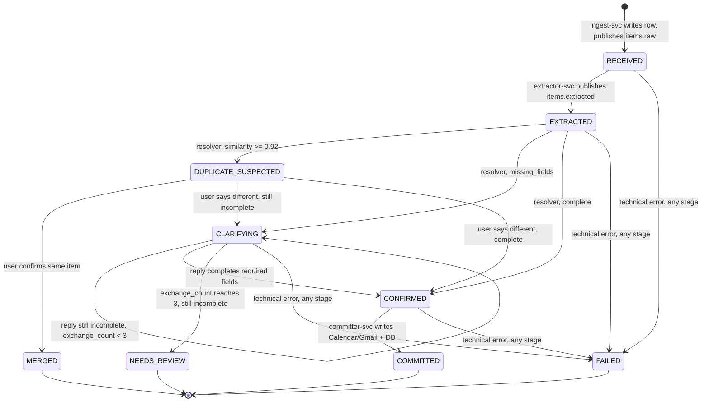
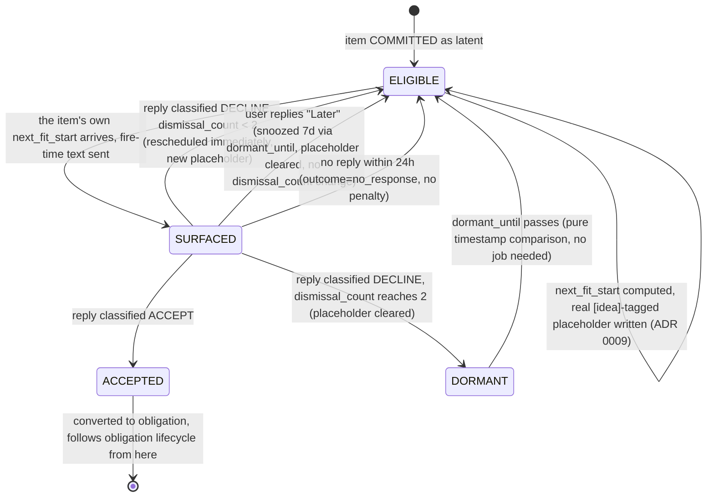

# State Machine

Second doc in the architecture set — see `overview.md` §0 for the full list. This doc owns everything `overview.md` deferred under "conversations state machine detail" and "how clarification exchanges are counted, batched, and exhausted."

Two lifecycles, deliberately kept separate:
1. **Pipeline lifecycle** — every item goes through this once, linearly, from `RECEIVED` to a terminal state.
2. **Latent lifecycle** — only applies after a latent item reaches `COMMITTED`; cyclical, can run for weeks.

Per ADR [0001](../decisions/0001-no-orchestrator-agent.md): every transition below is triggered by pipeline code reacting to an event (a Pub/Sub message consumed, a user reply parsed, a dispatcher run completing) — never by an agent deciding to move the item forward.

---

## 1. Pipeline lifecycle



### State reference

| State | Meaning | Who acts here | Persisted? |
|---|---|---|---|
| `RECEIVED` | Raw item stored, awaiting extraction | `extractor-svc` consumes | Yes |
| `EXTRACTED` | Structured fields present, not yet checked | `resolver-svc` consumes | Yes |
| `DUPLICATE_SUSPECTED` | High-similarity match found, awaiting user disambiguation | `resolver-svc`, waits on SMS reply | Yes |
| `CLARIFYING` | Missing/low-confidence fields, question sent | `resolver-svc`, waits on SMS reply | Yes |
| `NEEDS_REVIEW` | Clarification budget exhausted, still incomplete | Terminal for MVP — see §1.3 | Yes |
| `CONFIRMED` | Complete record published to `items.confirmed`, about to commit | `committer-svc` consumes from `items.confirmed` | Yes (brief) |
| `COMMITTED` | Written to Calendar/Gmail + DB | Terminal for obligations; start of latent lifecycle (§2) for latents | Yes |
| `MERGED` | Confirmed duplicate of an existing item | Terminal | Yes |
| `FAILED` | Technical failure at any stage | Dead-letter, see §3 | Yes |

### 1.1 Dedupe check (on entering `EXTRACTED`)

Runs once, immediately, before the completeness check — per PRD §5.2 ordering.

1. Embed `title + summary` (`text-embedding-004`), cosine search `item_embeddings` for this user.
2. `similarity ≥ 0.92` → `DUPLICATE_SUSPECTED`. Ask naturally whether this is the same as the existing item. A positive reply → `MERGED` (no new `obligations`/`latents` row is created; the existing item's record is left untouched — a duplicate confirms nothing new, it discards the incoming one). A negative reply → proceed to the completeness check as if no match existed.
3. `0.82 ≤ similarity < 0.92` **and** the existing match is a latent → not a blocking state. This is folded into the resolver conversation as an optional attachment offer rather than its own stage, since PRD §5.2 calls it an "offer," not a requirement. `parent_item_id` is set only if the user opts in.
4. Below `0.82` → no dedupe action.

### 1.2 Completeness check (on entering `EXTRACTED`, after dedupe clears)

**`resolver-svc` creates the `conversations` row unconditionally at this point** — even when nothing is missing and the item goes straight to `CONFIRMED` — because it's also where a `due_at` the extractor already resolved gets staged (`conversations.resolved_fields`, `data-model.md` §2.4) ahead of commit, not only a scratchpad for multi-turn clarification.

- `missing_fields` non-empty → `CLARIFYING`.
- Otherwise → `CONFIRMED` directly: publish `ConfirmedItemMessage` and let `committer-svc` write Calendar/Gmail/DB.

**Resolved gap, found in step 10 and superseded by v1 polish:** confidence is now observability, not a state-transition gate. A confidence-only trigger (empty `missing_fields`, low `confidence`) has nothing concrete to ask about, so it commits like any other complete item.

**Exchange counting**, precisely (PRD §5.2 says "max 3 exchanges" without defining the unit — defined here):
- One exchange = one outbound clarification question from `resolver-svc`. `conversations.exchange_count` increments **when the question is sent**, not when the reply arrives.
- On each inbound reply, `resolver-svc` merges the answer into the item's fields and re-checks `missing_fields`.
  - Still incomplete and `exchange_count < 3` → send the next question (batching all remaining missing fields into one message), increment `exchange_count`, stay in `CLARIFYING`.
  - Complete → `CONFIRMED`; publish `ConfirmedItemMessage` immediately.
  - Still incomplete and `exchange_count == 3` → `NEEDS_REVIEW`. No 4th question is sent.
- A thread-attachment offer (§1.1.3), if applicable, rides on the resolver conversation — it does not consume clarification budget and does not block commit. Attaching the thread is a separate, optional acknowledgment the user can ignore with no consequence beyond the two items staying unlinked.

### 1.3 `NEEDS_REVIEW` — terminal for MVP

**Decision made in this doc:** there is no automated recovery path out of `NEEDS_REVIEW`. If the system can't get the required fields in 3 exchanges, it stops asking rather than nagging — an unresolved item is safer than a guessed one. The user can always send the item again as a fresh message, which creates a new `items` row and starts over; there is no attempt to detect "this is a retry of that stuck item" — that's real complexity for a case that shouldn't occur often against a well-tuned extractor. Worth an ADR if this needs to change post-hackathon; not worth one now.

### 1.4 Auto-commit once complete

**V1 polish, user-directed:** `AWAITING_CONFIRMATION` is retired from the normal path. Once an item is structurally complete, `resolver-svc` publishes `items.confirmed` immediately and sends a natural acknowledgment. There is no confirmation timeout because there is no open confirmation state to expire.

`ingest-svc` may still route legacy `AWAITING_CONFIRMATION` rows to `resolver-svc` so old in-flight items do not strand after a deploy, but no current code path creates new ones.

### 1.5 `CONFIRMED` → `COMMITTED`

`resolver-svc` publishes to `items.confirmed` the instant dedupe clears and required fields are present — this is the one and only place a message is allowed onto that topic from the forward pipeline (§4 covers the second, narrower path from `dispatcher-svc`). The message is built by reading the `items` row plus `conversations.resolved_fields` and merging them (`agent-contracts.md` §3.5) — this is where a staged `due_at` finally reaches a service that can write it anywhere durable. `committer-svc` consumes, and branches on `type`: for an obligation it writes Calendar (or Gmail, per ADR 0008, selected by `action_type`) and `INSERT`s `obligations`; for a latent it makes no external write and just `INSERT`s `latents`. Either way it sets `COMMITTED`. If `committer-svc` fails here, it's a technical failure (§3), not a new user-facing state.

**Resolved, step 15, updated for v1 polish — the email branch's mechanics, no new state needed.** An email obligation flows through `RECEIVED → EXTRACTED → (DUPLICATE_SUSPECTED →) (CLARIFYING →) CONFIRMED → COMMITTED` exactly like a calendar obligation — `committer-svc`'s branch on `action_type` (`agent-contracts.md` §2.1) is the only place the two paths actually differ, and it was already anticipated by `obligations.action_type`'s `CHECK` constraint (`data-model.md` §2) since step 1. No new column, no new state.

- `committer-svc` sends via `POST https://gmail.googleapis.com/gmail/v1/users/me/messages/send` with a base64url-encoded RFC 2822 MIME message built from `confirmed.email_draft` (body) and the recipient staged in `conversations.resolved_fields` (`agent-contracts.md` §3.2's step-15 addition) — same `AuthorizedSession`/refresh-token pattern already used for Calendar, requesting `gmail.send` scope instead of `calendar.events` on the `Credentials` object for that one call. No new OAuth bootstrap needed: `scripts/bootstrap_oauth_token.py` already requests both scopes together (`infrastructure.md` §4) — this was true since step 6, unused by any code until now.
- The `obligations` row gets `email_draft` (the sent body, for a real record of what was actually sent — not re-fetched from Gmail) and `email_sent_at = now()`, written in the same transaction as the row's `INSERT`, mirroring exactly how `calendar_event_id` is written for the calendar branch.
- **"`email_sent_at` set exactly once — no duplicate sends on retry or DLQ replay"** (`test-plan.md` step 15's pre-existing constraint) is already satisfied by the idempotency guard `_already_committed()` already provides (step 13, refined in step 14) — it checks whether an `obligations` row exists for the item *before* attempting either external write, calendar or email, so a redelivered `items.confirmed` message is a no-op regardless of which branch it would have taken. No email-specific mechanism needed; the existing guard was already written generically enough.
- **Explicit scope boundary, not a silent gap:** `dispatcher-svc`'s accepted-suggestion path (§2.3) always publishes `action_type="calendar"` — a resurfaced latent can never become an email action. A latent's own extraction never runs through the email-classification rules above (it was classified `type="latent"` at capture time, with no recipient ever asked about), so there's no `email_recipient`/`email_draft` for the accept path to have staged even if it wanted to.

---

## 2. Latent lifecycle (post-`COMMITTED`)

Only applies when `items.type = 'latent'`. `items.state` stays `COMMITTED` for the item's entire life from here on — the sub-lifecycle below is **derived**, not a separate stored enum, from `latents` + `suggestions` columns already in the schema (PRD §8). This is deliberate: avoids a second state field that could drift out of sync with the rows that actually drive it.

**Derivation rule**, evaluated whenever the current phase is needed (dispatcher scoring, a status query, etc.):

```
if latents.dormant_until is not null and dormant_until > now():
    phase = DORMANT
elif exists a suggestions row for this item with outcome IS NULL:
    phase = SURFACED
else:
    phase = ELIGIBLE
```



**Revised, ADR [0009](../decisions/0009-tentative-placeholder-write-before-confirm.md), user-directed:** `ELIGIBLE → SURFACED` no longer happens because a dispatcher run scored this item highest against every other candidate — the old `revival_score`/`REVIVAL_THRESHOLD` engine and its "at most one suggestion per run" restraint are gone. Every non-dormant committed latent gets its own `next_fit_start` and its own real, tagged placeholder event on the calendar (capacity-engine.md §5), independently of every other latent; `SURFACED` now triggers off that specific item's own slot arriving (a Cloud Task), not a cross-item comparison.

### 2.1 Eligibility gate (`ELIGIBLE` phase — reconsidered without a scorer, ADR 0009)

There is no scorer left to gate candidates *for*, so the PRD §6.3 filter is narrower than it originally was:
- `days_since_capture < 3` — **removed**. Existed only to protect a batch score from a too-fresh item; with no score, suppressing a brand-new idea's own first slot would directly contradict "schedule it for the next eligible slot."
- `last_surfaced_at` within the last 10 days — **removed**. A first-dismissal reschedule (§2.2) is very often inside that window by design — suppressing it there would break the reschedule the whole model exists to provide.
- `dormant_until` in the future → still excluded — `_eligible_latents`'s own SQL filter, not a post-fetch check.
- an open (`outcome IS NULL`) `suggestions` row already exists → still excluded (already `SURFACED`, never recompute/re-text mid-conversation).

### 2.2 `SURFACED` outcomes — decisions made in this doc

PRD §6.3 defines `Later` (snooze 7d) and dismissal (`dismissal_count ≥ 2` → dormant 30d) but not what `dormant_until` means mechanically or what happens on no reply. Resolved here:

- **`dormant_until` is reused for both snooze and dismissal-dormancy.** It generically means "not eligible until this timestamp." What differs is only whether `dismissal_count` was also incremented (dismissal: yes; snooze: no). One column, two callers.
- **No reply within 24h → `outcome = 'no_response'`.** No dismissal penalty (silence isn't rejection). Since the "not eligible within 10 days of `last_surfaced_at`" rule that used to prevent an immediate resurface is gone (§2.1, ADR 0009), a no-response item can be recomputed and re-texted again as soon as the next sweep finds a fitting slot — closes the one PRD gap where a `suggestions` row could otherwise sit with `outcome IS NULL` forever, permanently stuck in `SURFACED`.
- **ADR 0009: N and Later now also clear or move the real placeholder, not just the DB columns.** First dismissal (`dismissal_count` about to become `< 2`) reschedules immediately — the placeholder *moves* to the next fitting slot via `PUT .../placeholder` (capacity-engine.md §5.3), not left tagged at a slot the user just declined. Second dismissal (`dismissal_count` reaches 2) and `Later` both `DELETE` the placeholder outright, since neither has anywhere to move it to right now.

### 2.3 `ACCEPTED` — how a latent actually becomes a calendar write

`dispatcher-svc` has no Calendar *write* scope (`overview.md` §3 — only `committer-svc` writes externally). So acceptance doesn't write directly; it re-enters the pipeline at the one place that's allowed to:

1. User replies to a suggestion in natural language; `ingest-svc` routes it to `dispatcher-svc` (§4), which classifies the reply as an acceptance (`dispatcher_svc/conversation.py::converse_suggestion`, `agent-contracts.md` §4.2 — replaces an earlier literal-`Y` keyword match).
2. `dispatcher-svc` sets `suggestions.outcome = 'accepted'`, computes the target slot — **event start = the start of the `largest_contiguous_block` on the suggested day; duration = `effort_minutes`, capped at the block length** (decision made here; PRD names the block but not the exact slot placement) — and publishes directly to `items.confirmed` with `type` flipped to `obligation`, `due_at` set to that computed start time.
3. `committer-svc` consumes it exactly as it would a resolver-confirmed item — it has no way to tell the two apart, and doesn't need to. **ADR 0009 addition:** before writing, it checks `latents.placeholder_event_id` for this item — if a real placeholder already exists (true for every latent surfaced via the ADR 0009 fire-time flow), it `PATCH`es that same Calendar event in place (tag/description stripped, real title/time set) instead of `POST`ing a duplicate, then clears the placeholder columns in the same transaction.

This reuses the existing commit path instead of giving `dispatcher-svc` its own write credential, matching the reuse pattern in ADR 0008 and keeping the write-access matrix in `overview.md` unchanged in shape (one new topic-publish permission, no new external scope).

**Resolved gap, found building step 14 for real:** `committer-svc`'s items-row UPDATE only ever set `state`, never `type` — harmless for every path built before this one, since a resolver-confirmed item's `type` never changes between `EXTRACTED` and `COMMITTED`. This accept path is the first caller that actually needs `type` to change (a latent becoming an obligation) — fixed by always writing `confirmed.type` there, a no-op for the pre-existing path and correct for this one, keeping "`committer-svc` has no way to tell the two apart, and doesn't need to" literally true rather than just true in spirit.

**Resolved gap, also found building step 14: `ConfirmedItemMessage.effort_minutes` is a strict `Literal[15, 30, 60, 120, 240]` (`schemas.py`) — "capped at the block length" can't mean an arbitrary integer.** Decided: use the largest of the five buckets that's `<=` both the item's original `effort_minutes` and the block's actual length, falling back to the smallest bucket (15) if even that overruns. An explicit acceptance always gets scheduled somewhere rather than being silently refused over a small bucket-granularity overrun.

**Resolved gap: the slot a suggestion was built from can be stale by the time a reply arrives** — a user might reply hours or a full day later, and the day's real Calendar state can have changed in between (more events booked, or the fire-time computation simply ran a while ago). `dispatcher-svc`'s accept handler re-fetches real, current Calendar events for the suggested day and recomputes the largest free interval at accept time, **excluding the item's own real placeholder event from that re-fetch** (ADR 0009 — otherwise the placeholder itself would incorrectly read as busy time blocking its own slot). If the day has genuinely filled up since (some other real event), the suggestion is dismissed with an apologetic message rather than scheduling into a conflict or silently failing.

---

## 3. Failure handling (`FAILED` / dead-letter)

Applies uniformly across the pipeline lifecycle, per `overview.md` §4. Distinguish two failure classes:
- **Bad input** (malformed webhook payload, unparseable reply) → handled inline, rejected with a logged reason and an HTTP error status, at the two synchronous endpoints only (`ingest-svc`'s Twilio webhook, `resolver-svc`'s `/reply`) — neither is Pub/Sub-mediated, so "does not consume a delivery attempt" is trivially true: there's no subscription, retry count, or dead-letter policy in play at all for these two endpoints. (Resolved in step 13, building this for real: a malformed *internal* Pub/Sub envelope — decode failure on `items.raw`/`items.extracted`/`items.confirmed` — is deliberately **not** treated as this "bad input" case; see the technical-failure bullet below.)
- **Technical failure** (Gemini call errors, DB unavailable, Calendar API 5xx, **or a malformed Pub/Sub envelope on an internal topic** — internal corruption, since each service controls its own publisher, is a signal something is actually broken, not untrusted external input to reject and move on from) → normal Pub/Sub retry, dead-letter policy at `max_delivery_attempts=5` (Pub/Sub's actual minimum — `3` was assumed and rejected by the real API, found in step 4), then the `.dlq` topic + a `dead_letters` row (`item_id`, `stage`, `payload`, `error`, `retry_count`). `items.state` is set to `FAILED` at this point — written by `committer-svc`, the one service already positioned to own this (`infrastructure.md` §2.1).

**Replay is manual, not automatic.** An operator reads the `dead_letters` row (`scripts/replay_dead_letter.py <id>`), fixes the root cause if needed, and republishes the stored payload to the topic matching `stage`. On successful reprocessing, `items.state` moves forward from wherever it left off — replay re-enters the state machine at the failed stage, it does not restart from `RECEIVED`.

**Idempotency, resolved in step 13 — found for real in step 11's live testing, not invented speculatively; refined twice more by real findings, once while verifying step 13 itself and again verifying step 14's accept path.** Pub/Sub's at-least-once delivery means the *same* message can arrive at a consumer more than once even well before hitting the dead-letter threshold (a slow cold start exceeding the ack deadline is enough).

`resolver-svc`'s `/pubsub/push` guard checks whether a `conversations` row already exists for the item — not `items.state`. A first draft checked `items.state != 'RECEIVED'`; a real failure reproduced during step 13's own verification (a deliberately-invalid foreign key on the `conversations` INSERT) showed why that's wrong: `_write_item()` commits the `items.state` transition in its own earlier transaction, separate from the `conversations` INSERT that follows, so the forced failure left an item stuck at a post-`RECEIVED` state with no conversation ever created — a state-only guard swallowed every subsequent redelivery as "already done" forever, so the message never reached 5 delivery attempts and never reached `dead_letters`, silently defeating the exact mechanism step 13 exists to build. The `conversations` row — `data-model.md` §2.4/§2.7's documented "created unconditionally, the instant a success path finishes" — is the one true completion signal instead.

`committer-svc`'s `/pubsub/push` guard checks whether the row this exact message type would write already exists (`obligations` for `type="obligation"`, `latents` for `type="latent"`) — also not `items.state`. A first draft checked `items.state != 'CONFIRMED'`, reasoning that `committer-svc`'s `obligations`/`latents` INSERT and its `items` state UPDATE commit together in one transaction, so a real mid-processing failure would roll both back and never wrongly get swallowed. That reasoning held for every path built through step 13 — but a real bug found verifying step 14's accept path against real infra broke it: `dispatcher-svc`'s accept publish for a latent arrives with `items.state` already `'COMMITTED'`, from that item's *original* commit as a latent (§2.3) — a second, legitimate pass through this endpoint for the same item, not a redelivery of anything. The state-only guard silently swallowed it: no `obligations` row was ever written, no Calendar event created, no error logged anywhere — the accept just vanished, with `suggestions.outcome` left showing `'accepted'` and nothing to show for it. Checking the target table directly distinguishes "this exact message already succeeded" (the row exists) from "this item has a `COMMITTED` history for an unrelated, earlier reason" (the row for *this* message's type doesn't exist yet) — both `resolver-svc` and `committer-svc`'s guards are now keyed on the real completion artifact of the specific write in question, not a proxy for it.

Both are check-then-act guards, not hard transactional locks, but sufficient to catch the actual races observed.

**Known accepted limitation, not solved here:** `committer-svc`'s real Calendar write happens *before* its DB transaction (the external call can't be made atomic with the local commit). If the Calendar write succeeds but the subsequent `obligations` INSERT then fails for some other reason, no `obligations` row exists yet and a redelivery is *not* blocked by the guard above — it would re-run `_commit_obligation`, including a second real Calendar event. This needs an idempotency key passed through to the Calendar API to close fully (not something Google's Calendar API makes simple), which is real added complexity for a failure mode observed to be far rarer than the redelivery-after-success race the guard above actually protects against. Flagged here rather than silently left unhandled.

**Real fix, found verifying step 15's real Gmail send against real infra: the actual root cause of these redelivery races was never the missing guards alone — it was Pub/Sub's push-subscription ack deadline, silently defaulted to 10s the whole project (never explicitly set).** A real email-drafting extraction call (classify + compose a full body in one Gemini call, slower than a plain classify) took long enough that Pub/Sub redelivered concurrently before the first attempt finished — and this time it hit `extractor-svc`, which has **no** database access at all (ADR 0003) and therefore *cannot* have the same kind of idempotency guard `resolver-svc`/`committer-svc` do. Multiple concurrent deliveries raced on ADK's deterministic session id exactly like step 11's original finding, but this time enough of them failed that the message genuinely exhausted all 5 delivery attempts and reached `dead_letters` for real — not the "wasteful but harmless, absorbed downstream" case step 11 first documented. Fixed at the actual source: every push subscription now sets `--ack-deadline=60` (`scripts/deploy.sh`'s `setup_push_subscription`/`setup_dlq_subscription`), giving real Gemini/Calendar/Gmail calls enough headroom that the race is far less likely to trigger at all — a better fix than trying to add a DB-backed guard to a service that's deliberately not allowed to have one.

---

## 4. Inbound SMS routing (referenced from `overview.md` §2)

`ingest-svc` is the only Twilio webhook target. On every inbound message, before treating it as a new item:

```
1. open conversations row for this user (state DUPLICATE_SUSPECTED or CLARIFYING; legacy AWAITING_CONFIRMATION rows are still routed)?
     → yes: forward to resolver-svc (this is a reply, not a new item)
2. else, a suggestions row for this user with outcome IS NULL?
     → yes: forward to dispatcher-svc (this is a suggestion reply)
3. else: new item — store media if present, publish to items.raw
```

**Precedence, for the rare case both are open at once:** an open conversation wins. A pending suggestion just keeps waiting — it's still bounded by its own 24h no-response timeout (§2.2) independent of whatever's happening in the conversation, so it can't be starved indefinitely by a long clarification exchange.

Forwarding in steps 1–2 is a synchronous internal call (Cloud Run service-to-service IAM), because both `resolver-svc` and `dispatcher-svc` typically need to reply to the same SMS thread immediately (next question, or "got it, added to your calendar") — there's no reason to add queue latency to a live back-and-forth the way there is for the durability-sensitive forward pipeline.

**Build-order note, not a spec gap:** step 1 (forward to `resolver-svc`) was built when real multi-turn resolver conversations first landed; `ingest-svc` calls `resolver-svc`'s `POST /reply` with an ID-token-authenticated request, matching the synchronous-call design above exactly. Step 2 (forward to `dispatcher-svc`) is now built as the suggestion accept/decline/snooze path.

---

## 5. Open items for sibling docs

- ~~Exact `conversations.pending_fields` shape and how a batched multi-field question is rendered~~ → done, see `agent-contracts.md` §3.2.
- ~~Whether `dead_letters.payload_ref` points to GCS or is inlined for small payloads~~ → resolved, inline `jsonb`, see `data-model.md` §2.3.
- ~~`dormant_until` reuse (§2.2) needs to land in `data-model.md`'s column documentation~~ → done, see `data-model.md` §2 comment + §3.
